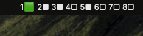

# Desk_Glance

Statusbar for mac (yabai) that displays all the windows and its occupation status.

* green: Which screen is focused
* white, which screen is occupied by windows

## Requirements:
* You need [yabai](https://github.com/koekeishiya/yabai) installed, in order for this Statusbar to work. This is because we make use of the [yabai](https://github.com/koekeishiya/yabai) api to fetch window and screen data.

## Installation
* clone the project `git clone https://github.com/Simuns/desk_glance.git`
* run the installation script `python3 install.py`
* load the service `launchctl load ~/Library/LaunchAgents/com.simuns.desk_glance.plist`

## Author: Símun Højgaard Lutzen | simunhojgaard@gmail.com